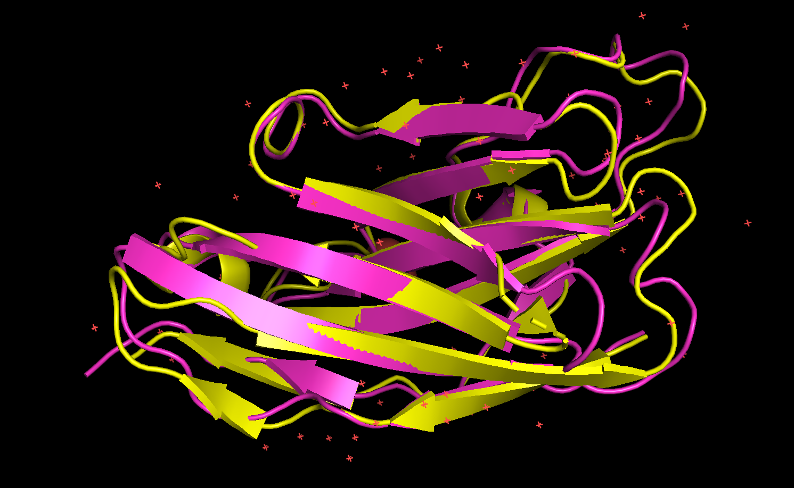

# Modal Functions for EGFR Binders
Follow the directions at https://modal.com to authenticate and install modal in a python environment.

## [NanoBodyBuilder2](https://github.com/oxpig/ImmuneBuilder?tab=readme-ov-file#nanobody-structure-prediction)

### Examples

See the [notebook](NB2_modal.ipynb) for python usage. The python implementation is recommended as it is far easier to submit multiple sequences. It is also recommended to install ipywidgets if using a notebook server.
___
For shell usage:
```shell
modal run NB2_modal.py --sequences 'QVQLQESGGGLVQPGGSLRLSCAASGRTFSSYAMGWFRQAPGKQREFVAAIRWSGGYTYYTDSVKGRFTISRDNAKTTVYLQMNSLKPEDTAVYYCAATYLSSDYSRYALPQRPLDYDYWGQGTQVTVSS' --out-dir 'predicted_structures' --ids "EgA1"
```
___
If no ids are provided the pdbs will be saved with the index of the corresponding sequence in the input list and may overwrite previous results.
### NanoBodyBuilder2 Predicted EgA1 Structure (Pink) Aligned with EgA1 from 4krn Solved Structure (Yellow) and RMSD:0.715


